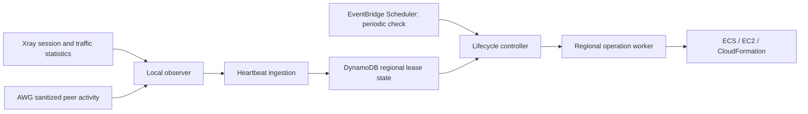

# On-demand regional lifecycle research

Reviewed September 20, 2026. **Research and recommended strategy, not an approved implementation plan.** Anthony wants any connected client, through any protocol, to keep an exit running; expiry follows the last connection/activity. Current ECS gateways, images, IAM, profiles and cloud resources were not changed during this review.

When to consult: designing activity detection, idle expiry, regional launch/stop/park/release orchestration, or adding another protocol. Current behavior remains in [lifecycle](../../docs/deployment-lifecycle.md), [ECS](../../docs/ecs.md) and [secrets](../../docs/secrets.md).

## What the deployed protocols can actually report

| Protocol | Useful signals | Meaning and limitations |
| --- | --- | --- |
| Xray/VLESS/REALITY | Authenticated-user online statistics plus per-user byte counters | Deployed v26.3.27 tracks source-IP references while dispatched authenticated sessions live. This is neither a unique-device count nor the client's VPN-toggle state. A quiet client can have no proxy sessions. Byte-counter deltas catch short sessions entirely between polls. |
| AmneziaWG | Peer receive-counter deltas and latest successful handshake, queried through `awg show` | Connectionless: no authoritative logout or disconnect event. Current daemon counts authenticated received keepalives as well as data. Prefer inbound evidence; server transmission alone does not prove a remote client is alive. Peer liveness is inferred within a policy window. |

**Version-specific Xray finding:** current [policy documentation](https://xtls.github.io/en/config/policy.html) describes a 20-second online criterion, but our selected [v26.3.27 online map](https://github.com/XTLS/Xray-core/blob/v26.3.27/app/stats/online_map.go) reference-counts live contexts; [dispatcher code](https://github.com/XTLS/Xray-core/blob/v26.3.27/app/dispatcher/default.go) adds/removes references for authenticated users. The deployed [StatsService schema](https://github.com/XTLS/Xray-core/blob/v26.3.27/app/stats/command/command.proto) includes GetStatsOnline and GetAllOnlineUsers. Verify the behavior with our exact image; do not encode current website prose as a timeless protocol guarantee.

Xray needs statistics/policy/API configuration and nonsecret opaque user labels in its `email` fields; these are labels, not actual email addresses. Our profile generator does not currently add them or enable statistics. Preserve UUIDs/REALITY keys and profiles when adding instrumentation. Enable only StatsService on an internal collector-only interface, not HandlerService or a public administration listener. No Xray fork or engine-image modification is implied. [API](https://xtls.github.io/en/config/api.html), [statistics configuration](https://xtls.github.io/en/config/stats.html).

AWG source checked at selected daemon commit `b5928efb6ca19f0153958460c3d141f04abc5c2e`: [receive path](https://github.com/amnezia-vpn/amneziawg-go/blob/b5928efb6ca19f0153958460c3d141f04abc5c2e/device/receive.go) validates decryption/replay before counting received transport, including keepalives; [UAPI](https://github.com/amnezia-vpn/amneziawg-go/blob/b5928efb6ca19f0153958460c3d141f04abc5c2e/device/uapi.go) exposes peer RX/TX and handshake values. Generated client profiles request PersistentKeepalive=25-35. This is configuration evidence, not a fresh observation that all native clients keep transmitting while asleep. [WireGuard protocol/timers](https://www.wireguard.com/protocol/).

Do not export `awg show ... dump` or the raw UAPI: they can expose private/preshared keys. Use explicit safe fields and reduce them locally to per-protocol presence/activity/health. A Unix socket mounted read-only still permits management commands; filesystem read-only does not make the UAPI read-only.

**Product limit:** off-the-shelf clients cannot guarantee a server-visible signal for an enabled-but-silent VPN toggle, especially on a sleeping phone. Define the automatic promise as observed authenticated presence/activity. For an unconditional hold, support permanent mode or an explicit user keep-running lease. A client-originated renewable lease could improve intent signaling, but needs client integration and validated mobile background behavior. No client change is currently selected.

## Established patterns and strategy comparison

OpenVPN offers [client-connect/client-disconnect hooks](https://openvpn.net/community-docs/community-articles/openvpn-2-6-manual.html), but those session semantics are not universal. WireGuard tooling commonly polls handshake/counter state; the [WireGuard exporter](https://github.com/MindFlavor/prometheus_wireguard_exporter) demonstrates that pattern. It is an example, not a selected dependency or verified AWG-compatible collector. Periodic snapshots repair missing events; hooks can accelerate them. Renewable leases are an established distributed-systems pattern, also used for [Kubernetes heartbeats](https://kubernetes.io/docs/concepts/architecture/leases/); this does not require Kubernetes here.

| Strategy | Benefits | Main limits | Assessment |
| --- | --- | --- | --- |
| Local idle daemon calls stop | Few components | Gateway holds lifecycle authority; timers/state disappear with host; regional teardown and remote launch still need external coordination | Avoid as owner of lifecycle decisions |
| Custom activity metric + CloudWatch alarm + Lambda | Small AWS integration for a fixed inactivity threshold | Still needs protocol instrumentation; parameterized policies, unknown telemetry, restart generations and concurrent commands need additional state | Viable narrow stop-only option |
| Heartbeats + durable lease + scheduled controller | Handles both protocols, restart recovery, configurable modes, multiple regions and independent launch/teardown | Small custom observer and explicit state machine required | Recommended |
| Controller polls via SSM Run Command | Engines need no publisher credentials; existing administrative path | Repeated remote commands/latency; broad execution surface; management outages must not look idle | Useful diagnostic or final confirmation tool, not preferred steady collector |

[AWS Instance Scheduler](https://docs.aws.amazon.com/solutions/latest/instance-scheduler-on-aws/solution-overview.html) supplies tag/calendar-based cross-region start/stop, not authenticated VPN-presence logic. [ECS service auto scaling](https://docs.aws.amazon.com/AmazonECS/latest/developerguide/service-auto-scaling.html) adjusts task count and can reach zero; it does not by itself implement our EC2/EIP/CloudFormation lifecycle. [ECS EventBridge events](https://docs.aws.amazon.com/AmazonECS/latest/developerguide/cloudwatch_event_stream.html) describe tasks/services/instances, not VPN clients. Use these for infrastructure reconciliation, not client presence.

## Recommended control shape

A small control stack persists independently of disposable exit stacks. One selected home region can hold the registry/lease table, heartbeat ingestion and controller; no always-running control host or global database is required for this product. Its region/availability dependency must be explicit. Keep lifecycle authorization in the controller, separate from observer/reporting authority.

Maintain one record per exit with desired mode, selected expiry action, authoritative resource identity, deployment/task generation, per-protocol observation freshness, last authenticated activity, optional user hold, policy version and operation state. Either protocol can renew the exit's lease. Permanent mode never auto-expires; fixed expiry needs an explicit choice about active-session override. Idle timeout starts after the last qualifying presence/activity, not merely the time the first connection opened.

Report complete bounded snapshots every roughly 30-60 seconds, including healthy zero activity. Suggested starting idle timeout: 30 minutes, configurable. Reporter health and client activity are distinct fields: sending a heartbeat does not itself extend a client lease. Keep only exit/protocol/generation/timing/boolean or aggregate-count data; no destinations, DNS queries, public peer addresses, UUIDs, raw public-key lists or secrets are needed centrally. Original byte counters can remain local. A restarted engine/observer must rebaseline counters rather than infer negative traffic or replay ancient activity.

Use **EventBridge Scheduler** for a periodic evaluator (for a few exits, one minute is sufficient), not a new state-machine execution for each heartbeat. An event bus is optional transport/fan-out; it does not infer absence or remember the authoritative expiry. [Scheduler precision is 60 seconds](https://docs.aws.amazon.com/scheduler/latest/UserGuide/schedule-types.html). A per-exit one-time schedule is another option, but each callback must still re-read current lease/policy/generation because a superseded event may arrive. [DynamoDB TTL](https://docs.aws.amazon.com/amazondynamodb/latest/developerguide/TTL.html) deletes asynchronously, potentially days later: use it only for old-record cleanup, never as the shutdown clock.

Cloud state mutations should use conditional versions/operation ownership. On expiry: mark a candidate, obtain a fresh quiet observation from every enabled protocol, allow renewal to cancel, then claim STOPPING against the current lease version. [Conditional writes](https://docs.aws.amazon.com/amazondynamodb/latest/developerguide/Expressions.ConditionExpressions.html) prevent stale controllers winning after renewal. They do not make a physical client connection atomic with an EC2 stop: once shutdown begins, a last-moment connection can still lose the race. Define that boundary and route later start requests to a new operation generation. A strict guarantee would need local admission/drain coordination, beyond simple heartbeat expiry.

**Missing/stale reports mean unknown, not idle.** Recommended default: leave a running exit up and expose the telemetry fault. Only expire from fresh healthy observations; an explicit fixed maximum lifetime would be a separate owner-selected exception. A task rollout, collector failure or control-region outage must not be misclassified as all clients leaving. ECS events can trigger reconciliation, but do not replace periodic state reads.

The operation worker must honor existing semantics: scale ECS to zero, wait for actual tasks to stop, then stop EC2; start waits for host health and restores the service. Park/release uses the owned-stack/retained-allocation logic, preserving images, parameters and regional GuardDuty. Raw StopInstances from an alarm bypasses that sequence. Rebuild/park/destroy can outlast a short function: use a bounded reconciler or Step Functions Standard with durable waits and retries. CDK synthesis/rebuild requires a reproducible build runner or reviewed deployment artifact, not merely calling the existing laptop CLI from Lambda.

For a central controller, regional Lambda AWS SDK clients can target each selected region. Step Functions' direct integrations do **not** provide generic cross-region API access; use a Lambda bridge or regional workflow. [AWS limitation](https://docs.aws.amazon.com/step-functions/latest/dg/concepts-access-cross-acct-resources.html), [CDK's Lambda-backed cross-region task](https://docs.aws.amazon.com/cdk/api/v2/python/aws_cdk.aws_stepfunctions_tasks/CallAwsServiceCrossRegion.html). No VPC peering or NAT-based control network is needed just to call AWS public control APIs.

A stopped/deleted exit cannot receive the initial VPN packet and wake itself. Launch must use an independent authenticated CLI/phone control path. Retained IPs preserve profile endpoints but remain billable; released IPs require regenerated endpoint/profile delivery. Keep the control stack outside the exit's stop/park/destroy scope.

## Where observation/reporting should live

The lifecycle decision should not live inside protocol engines. Native stats plus small adapters avoid upstream forks. There are two credible placements:

- **Host collector:** simplest access to both namespaces through existing host authority; query Xray StatsService and safe AWG fields, then publish through a narrowly scoped host role. Preserves engine images and absent task IAM. Adds privileged host code, and with our cloud-init model updates require a cold rebuild; this revives Anthony's concern about application logic coupled to the host lifecycle.
- **ECS-managed observer (preferred direction):** adds a small nonessential container within the existing shared task/budget. Query Xray on an internal restricted StatsService endpoint. AWG's existing wrapper can export a sanitized read-only activity file or purpose-built read-only endpoint; do not hand the observer the Docker socket, raw AWG management socket, protocol configs or NET_ADMIN. Restart/health behavior and bridge allow rules need explicit tests. This retains independent application delivery; actual observer overhead must be measured.

**Publishing authority remains a design choice.** An observer in the same task cannot have its own isolated task IAM role: [task-role permissions are shared by containers](https://docs.aws.amazon.com/AmazonECS/latest/developerguide/task-iam-roles.html). Our host currently disables task IAM entirely. Direct PutEvents from that task would require an explicit security/host-config change, even if permissions only allow activity publication; it must never grant lifecycle mutation.

A candidate preserving the current boundary is dedicated structured observer stdout through ECS-managed `awslogs`, with a CloudWatch Logs subscription invoking ingestion. The agent/driver owns AWS authority; engines and observer get no AWS credentials. [awslogs-region supports sending regional clusters to one log region](https://docs.aws.amazon.com/AmazonECS/latest/APIReference/API_LogConfiguration.html). Collect only the observer stream, retain it briefly, scope log-write permissions to its exit stream/group, and derive source identity from the trusted stream mapping rather than arbitrary payload resource IDs. Configure nonblocking delivery, but test log-driver startup dependencies as well as runtime outages.

The tradeoff is delay: [subscriptions usually deliver within three minutes](https://docs.aws.amazon.com/AmazonCloudWatch/latest/logs/Subscriptions.html), with retries that can be much later. Freshness windows must accommodate ordinary latency and reject stale/reordered data; unknown data vetoes idle shutdown. A direct authenticated event publisher is lower-latency if an isolated identity boundary is selected. For EventBridge, check per-entry PutEvents failures and use retry/backoff; [HTTP success alone is insufficient](https://docs.aws.amazon.com/eventbridge/latest/userguide/eb-putevents.html). There is no requirement to insert an event bus between a logs subscription and the lease writer.

## Questions and acceptance for the implementation plan

Confirm idle semantics for quiet/sleeping clients, telemetry-loss behavior, observer placement/transport, initial timeout, and expiry action. Define whether fixed expiry overrides active connections or is only a minimum hold. Select the control region and operator interface. These remain open; no additional AWS resources or client changes are approved by this research note.

Tests must cover both protocols separately and together; quiet AWG keepalives; short Xray sessions; blocked/replayed/unauthenticated traffic; client disappearance; engine/task/observer restart and counter reset; duplicate/delayed/out-of-order/missing reports; policy changes; renewal versus expiry; start versus stop/park/release; and deployment operations holding a lifecycle lock. Verify current-generation identity before every destructive action. Perform native phone sleep/background checks with owner coordination, not inferred from Docker probes.

Before implementing shutdown, validate the observer contract against disposable synthetic clients on the exact tracked Xray/AWG artifacts. That is the unresolved technical checkpoint from this research; source inspection is not a passing integration test. Then the full planned controller can reuse those signals without assuming perfect client-presence knowledge.
